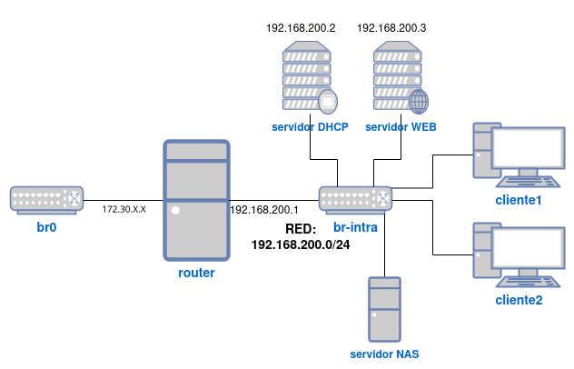

 

Vamos a crear una plantilla que utilizaremos para la creación de las máquinas que utilizaremos como clientes. Para ello:

- Crea con `virt-install` una máquina virtual de Debian 13 (trixie) con formato qcow2 y un tamaño de 3GiB.
    - La máquina debe tener un usuario `debian` con contraseña `debian` que puede utilizar `sudo` sin contraseña.
    - Instala el servidor ssh en la máquina.
- Convierte la máquina virtual en una plantilla llamada **plantilla-cliente**. El hostname de la máquina debe ser **plantilla-cliente-\<tunombre\>**. ¿Cuánto ocupa el volumen de la plantilla en disco?
- Utiliza la herramienta `virt-sparsify` para reducir el tamaño ocupado en disco del volumen. ¿Cuánto ocupa ahora el volumen de la plantilla en disco?

### Captura

Captura de pantalla donde se demuestre que la plantilla no se puede ejecutar.

---
### Solución

#### Creación de la máquina virtual:

```bash
  virt-install \
    --name plantilla-cliente-zinnico \
    --os-variant debian13 \
    --ram 1024 \
    --vcpus 1 \
    --disk path=/var/lib/libvirt/images/plantilla-cliente.qcow2,size=3 \
    --graphics none \
    --console pty,target_type=serial \
    --location 'http://deb.debian.org/debian/dists/trixie/main/installer-amd64/' \
    --extra-args 'console=ttyS0,115200n8 serial'
```

##### Durante la instalación, asegúrate de:

- Configurar el usuario `debian` con contraseña `debian`.
    Habilitar `sudo` sin contraseña para `debian` editando `/etc/sudoers` (consultar [el comando sudo](../../../99.-Anexos/08.-El%20comando%20sudo.md) en los anexos) y agregando.

```text
debian ALL=(ALL) NOPASSWD:ALL
```

- Instalar el servidor SSH (puedes instalarlo ejecutando `apt install ssh` una vez creada la máquina).

> Cambia el nombre de la máquina a `plantilla-cliente-<tunombre>` en el archivo `/etc/hostname`.

#### Conversión a plantilla

Una vez configurada la máquina, apágala y realiza un respaldo para reutilizarla como plantilla. Puedes hacerlo creando un snapshot o simplemente copiando la imagen.

Para verificar el espacio en disco ocupado inicialmente, utiliza:

```bash
du -sh /var/lib/libvirt/images/plantilla-cliente.qcow2
```
#### Reducción de tamaño con `virt-sparsify`

Usa `virt-sparsify` ([Compresión de imágenes con `virt-sparsify`](../../../01.-KVM/05.-Almacenamiento/07.-Compresión%20de%20imágenes.md)) para reducir el espacio en disco eliminado sectores vacíos:
```bash
sudo virt-sparsify --compress /var/lib/libvirt/images/plantilla-cliente.qcow2 /var/lib/libvirt/images/plantilla-cliente-sparse.qcow2
```
El proceso tomará cierto tiempo... paciencia.
Para verificar el nuevo tamaño del archivo reducido:
```bash
du -sh /var/lib/libvirt/images/plantilla-cliente-sparse.qcow2
```
